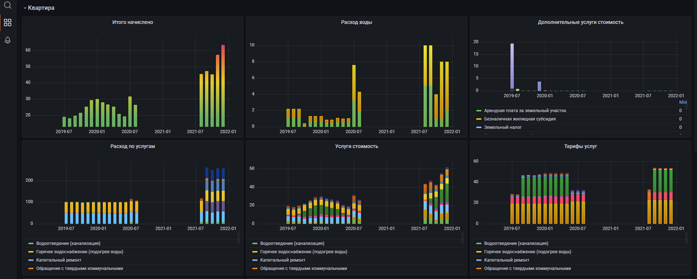

# Home Invoice (Жировки)

PHP скрипт решает две задачи:
1. Получение данных из PDF файла жировок 
2. Отправка полученных данных в базы данных для их дальнейшего отображения и анализа


### Результат показанный в Grafana




Для показа подобных графиков необходимо использовать Grafana + (Influx, Mysql или другие базы данных).\
[grafana.com](https://grafana.com)\
[influxdata.com](https://www.influxdata.com)

Для формирования графиков, как на скриншотах, можно использовать готовые JSON модели: 
1. [grafana.Mysql.json](docs/grafana.Mysql.json)
2. [grafana.InfluxDb2.json](docs/grafana.InfluxDb2.json)

А так же использовать схему [mysql.sql](docs/mysql.sql) для базы данных.

```
composer require opendataworld/home_invoice
```

## Примеры

### 1. Получение данных

```php
$content = file_get_contents('invoice.pdf');

$parser = new \HomeInvoice\Parser($content);
$invoice_text = $parser->getText();
$invoice_data = $parser->getData($invoice_text);

print_r($invoice_data);

Array (
    [month_name] => ноябрь
    [month] => 11
    [year] => 2021
    [payer_name] => XXXXX XXXXXXX XXXXXXXXX
    [address] => г. XXXXX, ул. XXXXX, д. XX, кв. XXX
    [personal_account] => XXXXXXXXX
    [date_created] => 14.12.2021 03:57:03
    [total_accrued] => 57.26
    [total_price] => 57.26
    [services] => Array (
        [0] => Array (
            [group_title] => Основные жилищно-коммунальные услуги
            [rows] => Array (
                [0] => Array (
                    [num] => 1
                    [title] => Техническое обслуживание
                    [unit] => кв. м
                    [volume] => 47.9
                    [rate] => 0.1238
                    [accrued] => 5.93
                    [privileges] => 0.00
                    [recalculation] => 0.00
                    [total] => 5.93
                )
                ...    
            )
        )
        [1] => Array (
            [group_title] => Возмещаемые расходы
            [rows] => Array (
                [0] => Array (
                    [num] => 1
                    [title] => Электроэнергия на освещение вспом. помещений иработу оборудования, за исключением лифтов
                    [unit] => кв. м
                    [volume] => 47.9
                    [rate] => 0.0224
                    [accrued] => 1.07
                    [privileges] => 0.00
                    [recalculation] => 0.00
                    [total] => 1.07
                )
                ...
            )
        )
    )
    [services_extra] => Array (
        [0] => Array (
            [title] => Переходящий остаток (задолженность; средства, зачисленные в счет будущих платежей)
            [value] => 0.00
        )
        ...
    )
    [cold_water_count] => 77
    [cold_water_diff] => 1
    [hot_water_count] => 90
    [hot_water_diff] => 7
    [house_square] => 10136.4
    [house_sub_square] => 0
    [house_people] => 373
    [house_people_energy] => 352.83
    [house_people_other] => 
    [house_hot_water_count] => 713.78
    [house_hot_water_cal] => 32.75
    [house_cold_water_count] => 959.19
    [house_energy] => 4243.00
    [house_energy_lift] => 957.00
)

```


### 2. Подготовка данных для сохранения в базу данных

```php
$transform = new \HomeInvoice\Transform($invoice_data);
$data = $transform->getData();

print_r($data);

Array (
    [simple]         => [...],
    [services]       => [...],
    [services_extra] => [...],
)
```